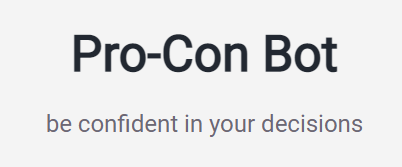
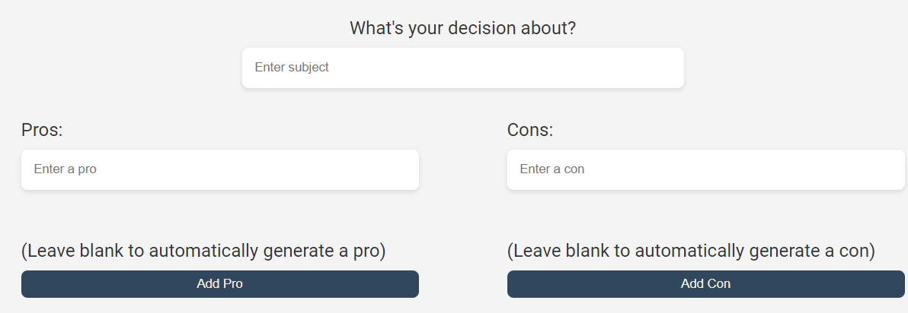
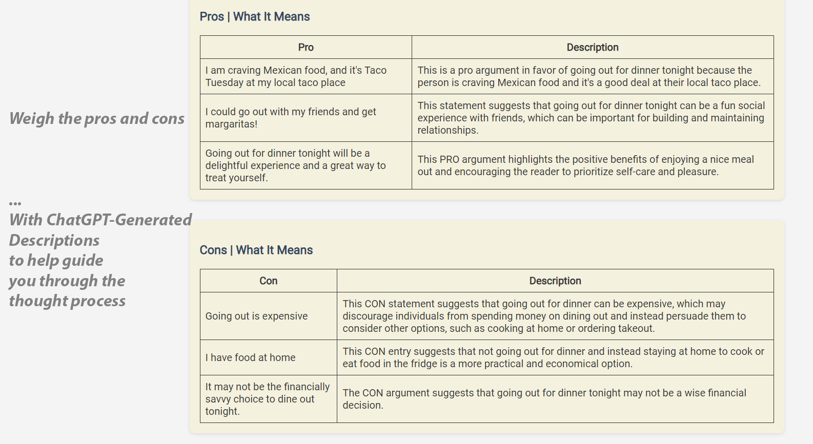
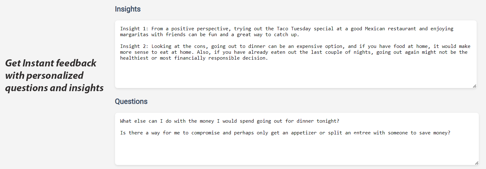

# Pro-Con Bot: Be confident in your decisions 

Welcome to ProConBot, an innovative tool designed to streamline and improve your decision-making process. This AI-assisted productivity application utilizes a simple and interactive interface to help you weigh the pros and cons of any decision subject you're dealing with. 

## Features

ProConBot is feature-rich and designed with the end user in mind. Here are some of the features that set it apart:

### Subject Entry and Pro/Con Inputs

ProConBot allows you to clearly define the subject of your decision, making it easier for you to focus on the problem at hand. In addition to entering your own pros and cons, the application also offers an AI-assisted feature that automatically generates a pro or con for you when you leave the entry field blank. 

### Pro/Con Tables

The application presents pros and cons in a clear, easy-to-understand table format. This visual representation of your decision points is a great tool for comparison and enables you to see at a glance the potential benefits and drawbacks of your decision. 

### Insights and Questions

ProConBot goes a step further to help you brainstorm insights and questions related to your decision. You can jot down your thoughts and ideas in these fields, facilitating a deeper understanding and analysis of the problem you're trying to solve.

## Getting Started

To get started with ProConBot, simply clone this repository. 
1. Open script.js, find the API_KEY variable, and replace the "enter your api key here" text with your [openai API key](https://platform.openai.com/account/api-keys)
2. Open the `index.html` file in your browser. 

## Contributions

Feel free to fork the repository and make changes as you see fit. Contributions, issues, and feature requests are welcome.

## License

This project is open-source, available under the [MIT License](https://opensource.org/licenses/MIT).
